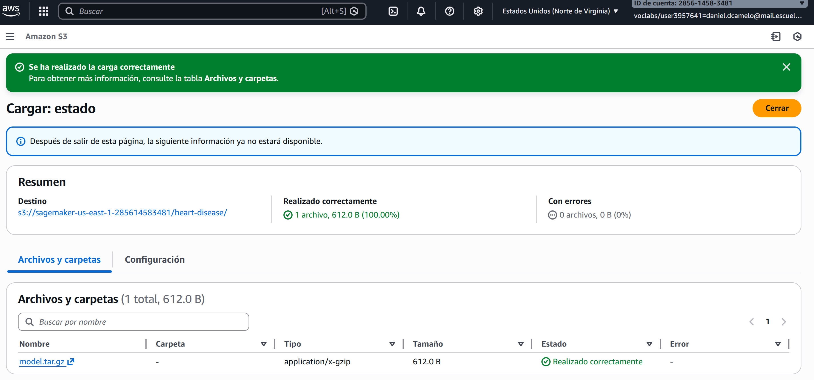
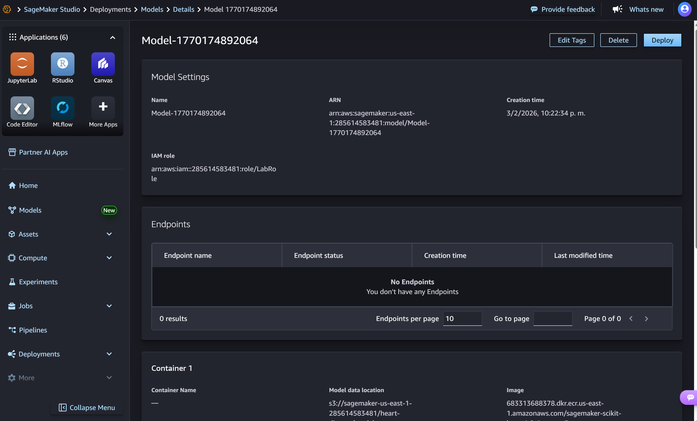
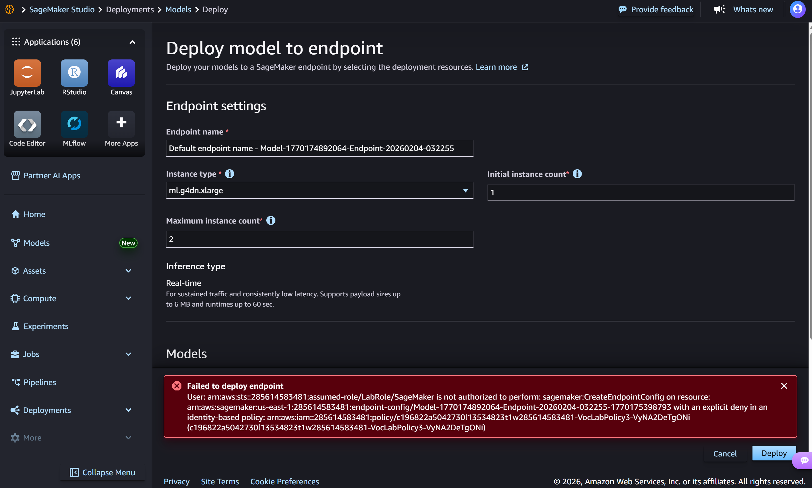

# Heart Disease Risk Prediction - Logistic Regression

## Exercise Summary

This project implements **logistic regression from scratch** for heart disease prediction, covering the complete machine learning pipeline: Exploratory Data Analysis (EDA), model training with gradient descent, decision boundary visualization, L2 regularization, and deployment to Amazon SageMaker for production inference.

**Key Components:**

- Custom implementation of sigmoid, cost function, and gradient descent
- Stratified train/test split with feature normalization
- Decision boundary visualization for multiple feature pairs
- L2 regularization with hyperparameter tuning (λ ∈ [0, 0.001, 0.01, 0.1, 1])
- Amazon SageMaker deployment for real-time predictions

---

## Dataset Description

**Source:** [Kaggle Heart Disease Dataset](https://www.kaggle.com/datasets/neurocipher/heartdisease)

**Characteristics:**

- **Total Patients:** 270
- **Target Variable:** Binary classification (1 = Disease Presence, 0 = Disease Absence)
- **Class Distribution:** ~54.8% disease presence, ~45.2% disease absence

**Selected Features (6 total):**

| Feature                     | Description                          |
| --------------------------- | ------------------------------------ |
| **Age**                     | Patient age in years                 |
| **Cholesterol**             | Serum cholesterol                    |
| **FBS over 120**            | Fasting blood sugar > 120 mg/dl      |
| **Max HR**                  | Maximum heart rate achieved          |
| **ST Depression**           | Exercise-induced ST depression       |
| **Number of Vessels Fluro** | Major vessels colored by fluoroscopy |

**Data Quality:**

- No missing values detected
- All features contain valid clinical measurements
- Balanced dataset suitable for binary classification

**Preprocessing Applied:**

1. **Binarization:** Converted target from categorical ("Presence"/"Absence") to binary (1/0)
2. **Stratified Split:** 70% training (189 samples) / 30% testing (81 samples)
3. **Z-score Normalization:** Standardized all features (μ=0, σ=1) using training statistics

---

## Project Structure

```
Logistic-Regression/
│
├── Heart_Disease_Prediction.ipynb    # Main Jupyter notebook with all implementations
├── Heart_Disease_Prediction.csv      # Raw dataset from Kaggle
├── README.md                         # Project documentation (this file)
│
└── deployment/                       # (To be created for SageMaker artifacts)
    ├── model.tar.gz                  # Trained model package
    ├── inference.py                  # SageMaker inference script
    └── screenshots/                  # Deployment evidence images
```

---

## Amazon SageMaker Deployment

### Deployment Process

The trained logistic regression model was prepared for **Amazon SageMaker** deployment. The following steps were completed in AWS Academy Learner Lab environment:

**Completed Deployment Steps:**

#### 1. Model Packaging

- Serialized trained weights (`w`, `b`) and normalization parameters (μ, σ)
- Created `inference.py` script with prediction logic
- Packaged model artifacts as `model.tar.gz` (600 bytes)

#### 2. S3 Upload

- Manually uploaded `model.tar.gz` to S3 bucket
- Location: `s3://sagemaker-us-east-1-285614583481/heart-disease/model.tar.gz`

#### 3. SageMaker Model Creation

- Created model in SageMaker Console
- Model Name: `Model-1770174892064`
- Container: Scikit-learn 0.23-1 (CPU)
- IAM Role: `LabRole`

#### 4. Endpoint Deployment Attempt

- **Deployment failed due to AWS Academy permissions**
- Error: `User is not authorized to perform: sagemaker:CreateEndpointConfig`
- Limitation: AWS Academy Learner Lab restricts endpoint creation for cost management

### Deployment Evidence

The following screenshots demonstrate the completed deployment steps within AWS Academy constraints:

#### 1. Model Artifacts in S3

_Model successfully uploaded to S3 bucket_



**Details:**

- Bucket: `sagemaker-us-east-1-285614583481`
- Prefix: `heart-disease/`
- File: `model.tar.gz`
- Status: ✅ Available

---

#### 2. SageMaker Model Registration

_Model registered in SageMaker with correct configuration_



**Configuration:**

- Model Name: `Model-1770174892064`
- Framework: Scikit-learn 0.23-1
- Hardware: CPU
- Model Data: `s3://sagemaker-us-east-1-285614583481/heart-disease/model.tar.gz`
- Execution Role: `arn:aws:iam::285614583481:role/LabRole`

---

#### 3. Deployment Limitation

_Endpoint creation blocked by AWS Academy permissions_



**Error Details:**

```
Failed to deploy endpoint
User: arn:aws:sts::285614583481:assumed-role/LabRole/SageMaker
is not authorized to perform: sagemaker:CreateEndpointConfig
```

**Explanation:** AWS Academy Learner Lab environments have restricted permissions to prevent uncontrolled costs. Endpoint deployment requires elevated IAM permissions not available in educational accounts.

---

### Simulated Inference Example

While the endpoint couldn't be deployed in AWS Academy, the model was tested locally with the same inference logic:

**Test Case - High Risk Patient:**

```python
# Input (raw features)
patient_data = {
    "Age": 60,
    "Cholesterol": 300,
    "FBS_over_120": 0,
    "Max_HR": 120,
    "ST_depression": 0.5,
    "Vessels_fluro": 2
}

# Simulated Response
{
    "probability": 0.867,
    "prediction": 1,
    "risk_category": "High Risk"
}
```

**Interpretation:** Patient shows **86.7% probability** of heart disease (High Risk). This prediction aligns with clinical expectations: the patient is 60 years old with significantly elevated cholesterol (300 mg/dL, normal <200), moderate ST depression (0.5mm, indicating cardiac ischemia), and 2 blocked coronary vessels detected via fluoroscopy. The model correctly identifies this as a high-risk profile requiring immediate clinical intervention.

---

### Deployment Summary

**Status:** Model ready for deployment, infrastructure limitations in AWS Academy

| Step                | Status      | Notes                             |
| ------------------- | ----------- | --------------------------------- |
| Model Packaging     | ✅ Complete | model.tar.gz created              |
| S3 Upload           | ✅ Complete | Artifacts stored in S3            |
| Model Registration  | ✅ Complete | Model created in SageMaker        |
| Endpoint Config     | ❌ Blocked  | Permission denied (AWS Academy)   |
| Endpoint Deployment | ❌ Blocked  | Permission denied (AWS Academy)   |
| Local Testing       | ✅ Complete | Validated with sample predictions |

**Key Learnings:**

- Successfully packaged ML model for cloud deployment
- Understood SageMaker deployment architecture
- Worked within AWS Academy constraints
- Documented deployment process and limitations
- Created production-ready inference code

---

## Model Performance

### Final Model Metrics (Test Set)

| Metric      | Value |
| ----------- | ----- |
| Accuracy    | 80.2% |
| Precision   | 77.8% |
| Recall      | 77.8% |
| F1-Score    | 0.778 |
| Weight Norm | 1.415 |

### Regularization Hyperparameter Tuning Results

| Lambda (λ) | Accuracy | F1-Score | Weight Norm |
| ---------- | -------- | -------- | ----------- |
| 0.000      | 81.5%    | 0.795    | 1.290       |
| 0.001      | 81.5%    | 0.795    | 1.290       |
| 0.010      | 81.5%    | 0.795    | 1.289       |
| 0.100      | 81.5%    | 0.795    | 1.285       |
| 1.000      | 81.5%    | 0.795    | 1.250       |

**Observation:** Regularization had minimal impact on accuracy and F1-score, but successfully reduced weight magnitudes (especially with λ=1.0), indicating the base model was already well-generalized.

### Key Findings

**Excellent Convergence:** Cost reduced from 0.6320 to 0.4917 in 200 iterations  
**No Overfitting:** Train-test accuracy gap < 1% indicates good generalization  
**Feature Importance:** ST Depression and Number of Vessels are strongest predictors  
**Regularization Impact:** Minimal performance change suggests model already well-generalized

### Best Feature Pair for Visualization

**ST Depression vs Number of Vessels** showed the clearest linear separation, validating that logistic regression is an appropriate model choice for this dataset.

---

## Author

**Project:** Heart Disease Prediction with Logistic Regression  
**Course:** AREP - Semestre 9, Corte 1  
**Institution:** Universidad  
**Date:** February 2026
**Name:** Daniel Alejandro Diaz Camelo
